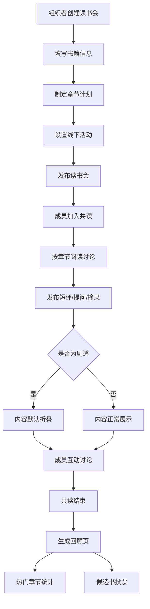

## 1. 产品概述

本产品是一个读书会共读讨论区平台，旨在帮助读书会组织者高效管理共读活动，促进成员深度阅读交流。通过结构化的章节讨论、内容防剧透机制和共读回顾功能，打造沉浸式的阅读社群体验。

## 2. 核心功能

### 2.1 用户角色

| 角色 | 描述 | 核心权限 |
|------|------|----------|
| 组织者 | 读书会发起者和管理者 | 创建书目、制定章节计划、设置线下见面时间、结束共读、生成回顾 |
| 成员 | 读书会参与者 | 查看章节计划、发布短评/提问/摘录、标记内容为剧透、投票候选书 |

### 2.2 功能模块

1. **首页/读书会列表**：展示进行中与已结束的读书会，快速加入或创建
2. **共读详情页**：展示书目信息、章节计划、讨论区、线下活动时间
3. **创建读书会**：组织者创建新共读、设置书籍信息、制定章节计划
4. **讨论区**：按章节组织的讨论，支持短评、提问、摘录，剧透内容折叠
5. **共读回顾页**：展示最受讨论章节、精彩内容汇总、下一本候选书投票

### 2.3 页面详情

| 页面名称 | 模块名称 | 功能描述 |
|----------|----------|----------|
| 首页 | 读书会列表 | 卡片式展示所有读书会，区分进行中/已结束状态 |
| 首页 | 创建入口 | 组织者快速创建新读书会的入口 |
| 共读详情 | 书目信息 | 书籍封面、标题、作者、简介、当前进度 |
| 共读详情 | 章节计划 | 时间轴展示章节划分、阅读截止时间、讨论热度 |
| 共读详情 | 讨论区 | 按章节分类的讨论列表，支持筛选类型（短评/提问/摘录） |
| 共读详情 | 线下活动 | 展示线下见面时间、地点、参与人数 |
| 共读详情 | 发布讨论 | 成员发布新讨论，可选择类型、章节、标记剧透 |
| 创建读书会 | 书籍信息 | 输入书名、作者、简介，上传封面 |
| 创建读书会 | 章节计划 | 动态添加章节，设置章节名、页码范围、截止时间 |
| 创建读书会 | 线下活动 | 设置线下见面的时间和地点 |
| 回顾页 | 共读总结 | 共读周期、参与人数、总讨论数统计 |
| 回顾页 | 热门章节 | 按讨论数排序的章节排行榜，展示精彩内容 |
| 回顾页 | 候选书籍 | 下一本候选书列表，支持投票，展示得票情况 |

## 3. 核心流程

### 3.1 组织者创建共读流程
组织者填写书籍信息 → 制定章节阅读计划 → 设置线下见面时间 → 发布读书会 → 成员加入 → 按章节讨论 → 结束共读 → 生成回顾页

### 3.2 成员参与讨论流程
选择章节 → 发布短评/提问/摘录 → 选择是否标记剧透 → 提交讨论 → 内容展示（剧透默认折叠）→ 其他成员互动

### 3.3 Mermaid 流程图

## 4. 用户界面设计

### 4.1 设计风格
- **设计主题**：温润书香风格，采用米白色调为主，搭配深棕色和藏青色作为点缀，营造阅读氛围
- **主色调**：暖米白 (#F8F5F0) 为背景，深棕 (#3D2914) 为文字，藏青 (#2C3E50) 为强调色
- **辅助色**：赭石色 (#C17817) 用于高亮和交互元素
- **按钮风格**：圆角矩形，微妙的悬浮阴影，按压有微缩反馈
- **字体**：标题使用「Source Serif Pro」衬线字体，正文使用「Inter」无衬线字体
- **布局风格**：内容区最大宽度 1200px，卡片式布局，大量留白
- **图标风格**：使用 Lucide 图标库的线性图标，保持简洁优雅

### 4.2 页面设计概述

| 页面名称 | 模块名称 | UI 元素 |
|----------|----------|----------|
| 首页 | 读书会列表 | 卡片网格布局，封面图+标题+状态标签+进度条 |
| 共读详情 | 书目信息 | 大幅封面图，标题，作者，简介，元数据 |
| 共读详情 | 章节时间轴 | 垂直时间轴，章节节点，讨论热度条，截止日期标记 |
| 共读详情 | 讨论区 | 标签切换（短评/提问/摘录/全部），讨论卡片，折叠剧透内容 |
| 共读详情 | 讨论发布器 | 类型选择器，章节选择，内容输入框，剧透开关 |
| 回顾页 | 数据统计 | 大号数字展示，渐变背景，微动画 |
| 回顾页 | 热门章节 | 排行条形图，章节名，讨论数 |
| 回顾页 | 候选书籍 | 书籍卡片网格，投票按钮，得票进度条 |

### 4.3 响应式设计
- **桌面端**：1200px 内容宽度，双栏布局（左侧章节导航，右侧讨论区）
- **平板端**：1024px 适配，单栏流式布局，章节导航折叠为下拉菜单
- **移动端**：375px 适配，卡片堆叠，底部导航，触控目标最小 44px

### 4.4 动效与交互
- 页面加载时元素按顺序淡入，从下往上轻微位移
- 卡片悬浮时有微妙的上浮和阴影加深
- 剧透内容展开/折叠有平滑的高度过渡
- 讨论提交成功后有轻微的成功提示动画
- 章节时间轴滚动时有渐显效果

