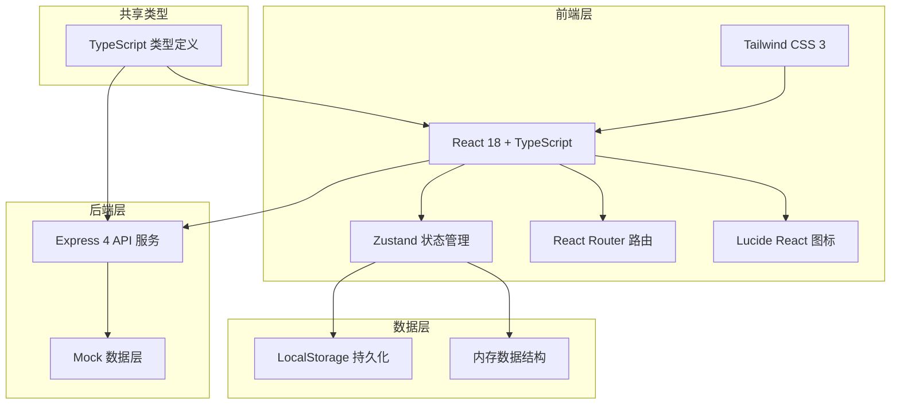
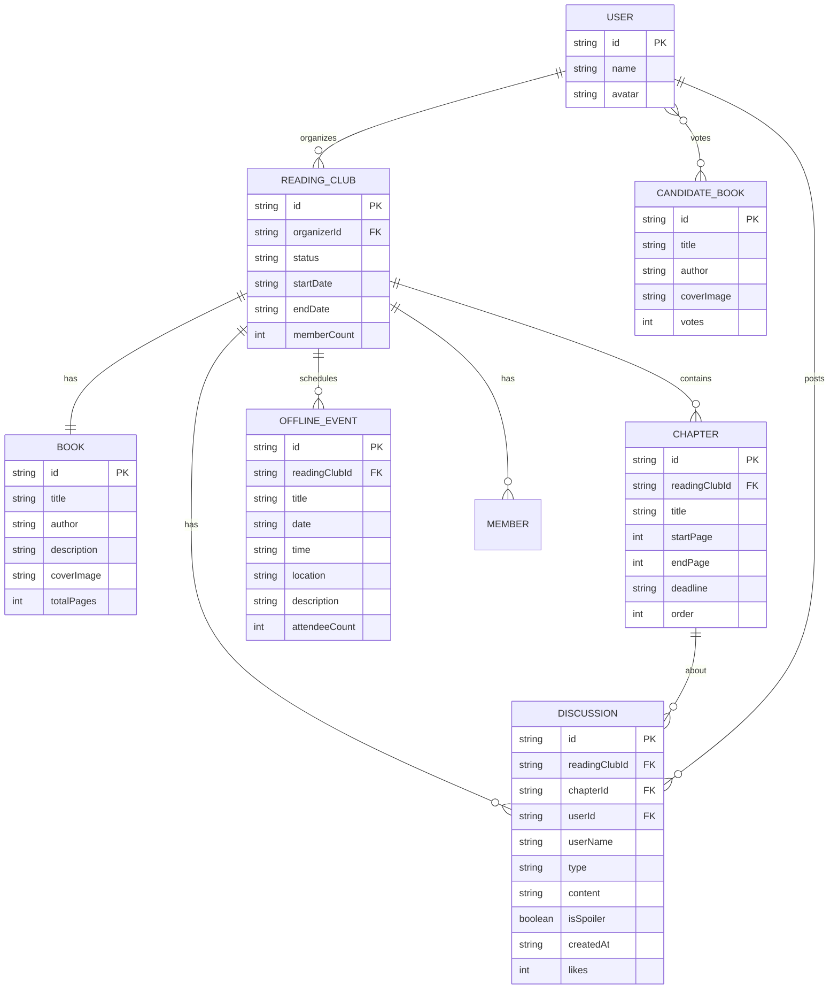

## 1. 架构设计



## 2. 技术描述

- **前端框架**：React 18 + TypeScript + Vite
- **样式方案**：Tailwind CSS 3，自定义主题配置
- **状态管理**：Zustand，支持 LocalStorage 持久化
- **路由管理**：React Router v6
- **图标库**：Lucide React
- **后端服务**：Express 4（开发阶段提供 Mock API）
- **数据存储**：LocalStorage 持久化 + 内存数据结构
- **初始化工具**：vite-init，使用 react-express-ts 模板

## 3. 路由定义

| 路由 | 页面 | 描述 |
|------|------|------|
| `/` | 首页 | 读书会列表、创建入口 |
| `/reading-club/:id` | 共读详情页 | 书目信息、章节计划、讨论区、线下活动 |
| `/create` | 创建读书会 | 书籍信息、章节计划、线下活动设置 |
| `/reading-club/:id/review` | 共读回顾页 | 共读总结、热门章节、候选书籍投票 |

## 4. API 定义（后端 Mock）

### 4.1 TypeScript 类型定义

```typescript
// 共享类型定义
export interface Book {
  id: string;
  title: string;
  author: string;
  description: string;
  coverImage: string;
  totalPages: number;
}

export interface Chapter {
  id: string;
  readingClubId: string;
  title: string;
  pageRange: string;
  startPage: number;
  endPage: number;
  deadline: string;
  order: number;
}

export interface Discussion {
  id: string;
  readingClubId: string;
  chapterId: string | null;
  userId: string;
  userName: string;
  type: 'comment' | 'question' | 'excerpt';
  content: string;
  isSpoiler: boolean;
  createdAt: string;
  likes: number;
}

export interface OfflineEvent {
  id: string;
  readingClubId: string;
  title: string;
  date: string;
  time: string;
  location: string;
  description: string;
  attendeeCount: number;
}

export interface ReadingClub {
  id: string;
  book: Book;
  chapters: Chapter[];
  offlineEvents: OfflineEvent[];
  discussions: Discussion[];
  organizerId: string;
  organizerName: string;
  status: 'ongoing' | 'ended';
  startDate: string;
  endDate: string | null;
  memberCount: number;
}

export interface Review {
  readingClubId: string;
  totalDiscussions: number;
  mostDiscussedChapters: { chapterId: string; chapterTitle: string; count: number }[];
  topDiscussions: Discussion[];
  candidateBooks: CandidateBook[];
}

export interface CandidateBook {
  id: string;
  title: string;
  author: string;
  coverImage: string;
  votes: number;
}
```

### 4.2 API 接口

| 方法 | 路径 | 描述 |
|------|------|------|
| GET | `/api/reading-clubs` | 获取读书会列表 |
| GET | `/api/reading-clubs/:id` | 获取读书会详情 |
| POST | `/api/reading-clubs` | 创建新读书会 |
| PATCH | `/api/reading-clubs/:id/end` | 结束共读 |
| GET | `/api/reading-clubs/:id/discussions` | 获取讨论列表 |
| POST | `/api/reading-clubs/:id/discussions` | 发布讨论 |
| GET | `/api/reading-clubs/:id/review` | 获取共读回顾 |
| POST | `/api/candidate-books/:id/vote` | 为候选书投票 |

## 5. 数据模型（ER 图）



## 6. 项目结构

```
/
├── src/
│   ├── components/          # 可复用组件
│   │   ├── BookCard.tsx
│   │   ├── ChapterTimeline.tsx
│   │   ├── DiscussionCard.tsx
│   │   ├── DiscussionForm.tsx
│   │   ├── Layout.tsx
│   │   └── SpoilerBlock.tsx
│   ├── pages/              # 页面组件
│   │   ├── Home.tsx
│   │   ├── ReadingClubDetail.tsx
│   │   ├── CreateReadingClub.tsx
│   │   └── Review.tsx
│   ├── store/              # Zustand 状态管理
│   │   └── useReadingClubStore.ts
│   ├── types/              # TypeScript 类型
│   │   └── index.ts
│   ├── utils/              # 工具函数
│   │   ├── mockData.ts
│   │   └── helpers.ts
│   ├── App.tsx
│   ├── main.tsx
│   └── index.css
├── api/                    # 后端 API
│   └── index.ts
├── shared/                 # 共享类型
│   └── types.ts
├── package.json
├── tsconfig.json
├── vite.config.ts
└── tailwind.config.js
```

